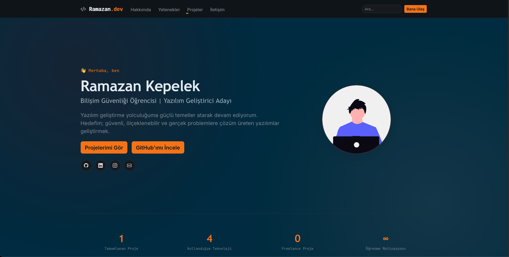
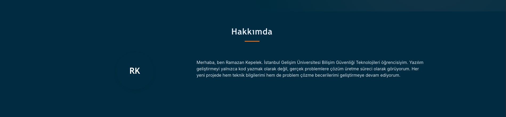
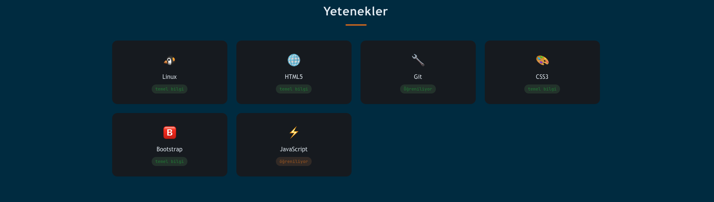
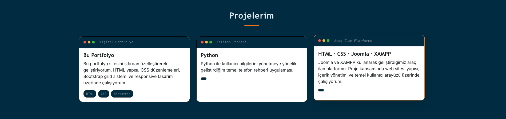
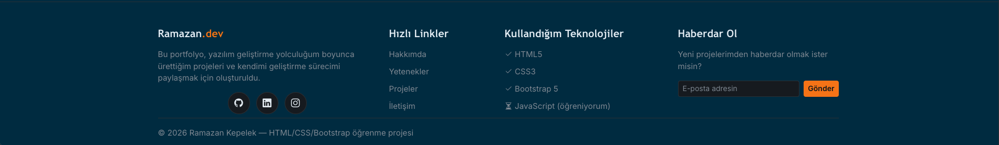

# 🎓 Kişisel Portfolyo Projesi — HTML / CSS / Bootstrap

Bu proje, HTML, CSS ve Bootstrap kullanılarak geliştirilmiş kişisel portfolyo web sitesi çalışmasıdır.

## 🎯 Proje Hedefi

Gerçek bir kişisel portfolyo sitesi oluşturarak aşağıdaki web geliştirme konularını uygulamak:

1. HTML ile sayfa yapısı oluşturmak
2. CSS ile sayfa tasarımını özelleştirmek
3. Bootstrap kullanarak responsive yapı oluşturmak
4. Navbar, hero, yetenekler, projeler ve iletişim gibi bölümleri bir arada kullanmak

## 📌 Proje Bölümleri

Web sitesi aşağıdaki bölümlerden oluşmaktadır:

- Ana Sayfa
- Hakkımda
- Yetenekler
- Projelerim
- İletişim
- Footer

## 🛠️ Kullanılan Teknolojiler

- **HTML5** — Sayfa yapısı ve içerik
- **CSS3** — Tasarım ve stil düzenlemeleri
- **Bootstrap 5.3** — Responsive yapı ve hazır bileşenler
- **JavaScript** — Temel etkileşimler

## 📸 Proje Görselleri

### Ana Sayfa



### Hakkımda



### Yetenekler



### Projelerim



### İletişim


### Footer



## 📁 Proje Yapısı

```text
ramazan-portfolio/
│
├── index.html
├── style.css
├── .gitignore
│
├── docs/
│   └── kod-aciklamalari.md
│
├── odevler/
│   ├── gorev-01-html-temelleri.md
│   ├── gorev-02-css-stilendirme.md
│   └── gorev-03-bootstrap.md
│
├── code-review/
│   └── review-checklist.md
│
├── bonus/
│   └── bonus-gorevler.md
│
└── README.md
